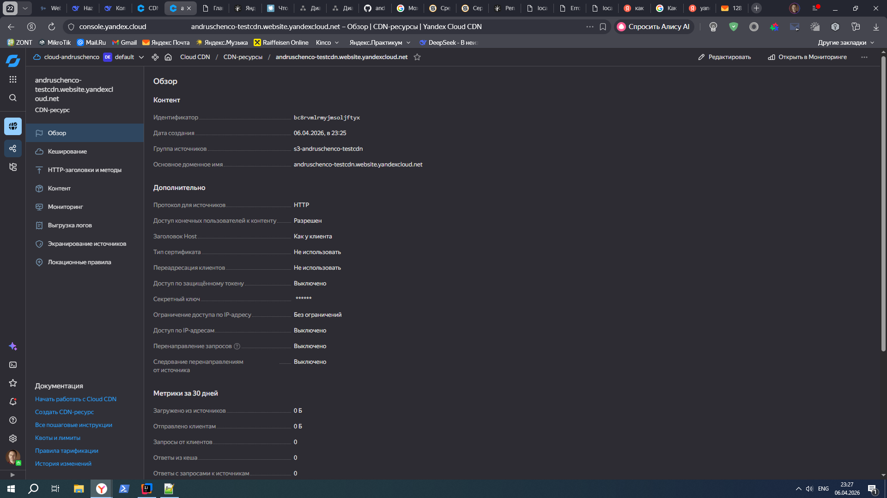

# Результаты выполнения заданий 

## Задание 1. Планирование
 - [Третий вариант Схемы](task1.drawio)

## Задание 2. Шардирование MongoDB
- [mongo-sharding](mongo-sharding)
- [README.md](mongo-sharding/README.md)
 
## Задание 3. Репликация
- [mongo-sharding-repl](mongo-sharding-repl)
- [README.md](mongo-sharding-repl/README.md)
 
## Задание 4. Кеширование
- Финальная работа находится в директории [sharding-repl-cache](sharding-repl-cache)
- В файле [README.md](sharding-repl-cache/README.md) который находится в директории **sharding-repl-cache** находится описание шагов по проверке.
 
## Задание 5. Service Discovery и балансировка с API Gateway
 - Финальная схема [Пятый вариант Схемы](task5.drawio)

## Задание 6. CDN
- [вариант Схемы](task6.drawio)
- Практика 

## Задания 7-10
- Задания 7-10 описаны в **Едином архитектурном документе** который доступен по ссылке [Architecture_Document_Tasks_7_10.md](Architecture_Document_Tasks_7_10.md)

---
###### Перенес исходные данные которые были в файле README изначально

# pymongo-api

## Как запустить

Запускаем mongodb и приложение

```shell
docker compose up -d
```

Заполняем mongodb данными

```shell
./scripts/mongo-init.sh
```

## Как проверить

### Если вы запускаете проект на локальной машине

Откройте в браузере http://localhost:8080

### Если вы запускаете проект на предоставленной виртуальной машине

Узнать белый ip виртуальной машины

```shell
curl --silent http://ifconfig.me
```

Откройте в браузере http://<ip виртуальной машины>:8080

## Доступные эндпоинты

Список доступных эндпоинтов, swagger http://<ip виртуальной машины>:8080/docs